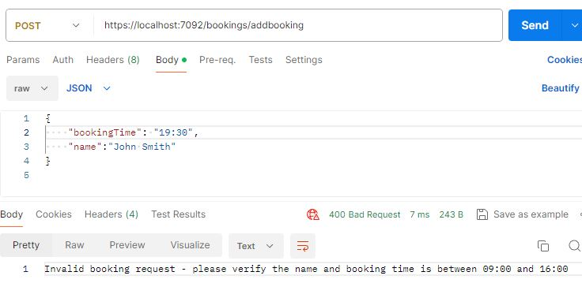

# InfoTrack - SettlementService
## How to run
- Clone the repo
- In Visual Studio 2022 open SettlementService/SettlementService.sln project
- Run the project (.NET 8)
- Use the attached postman collection to send requests

## Sample requests and responses
### 200 Ok

### 409 Conflict

### 400 Bad request invalid input

### 400 Bad request outside business hours
